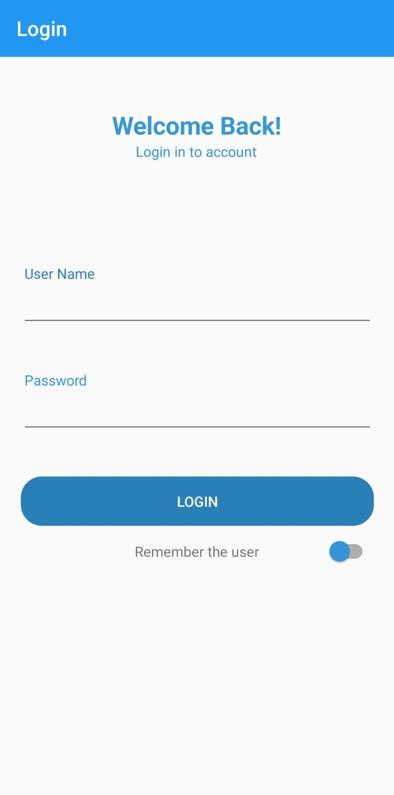
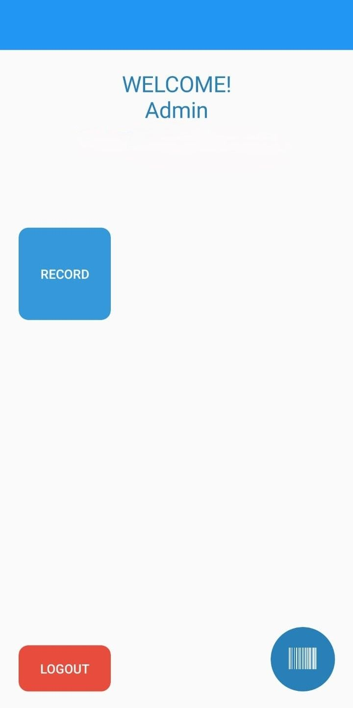
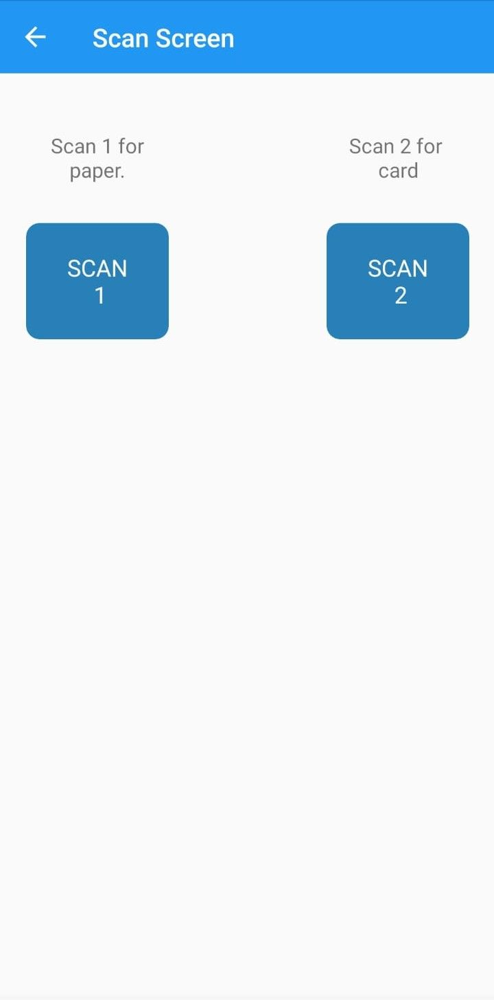
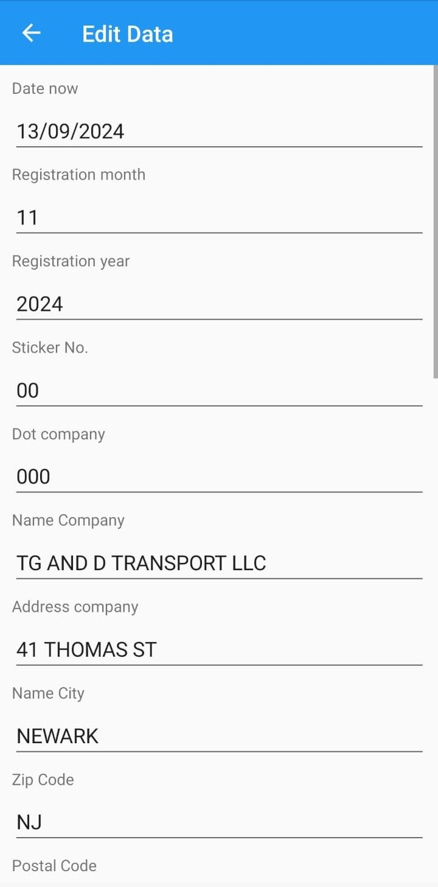
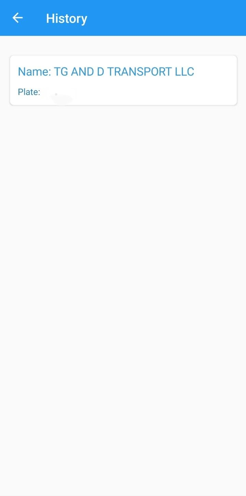
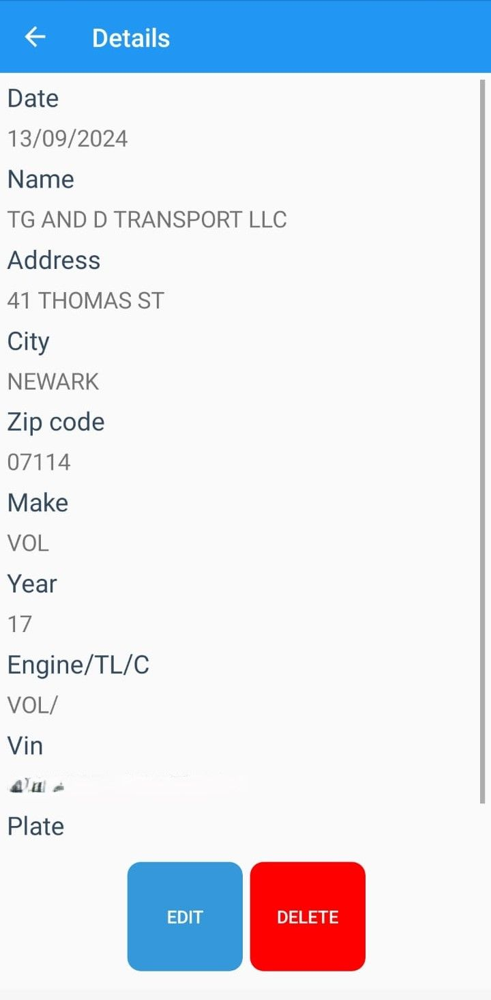

Aquí tienes un ejemplo de cómo puedes estructurar el archivo `README.md` para tu aplicación:

---

# 🚛 **InspectApp** - Vehicle Inspection Automation for the US 📱

## **Overview**

InspectApp is a custom-built Android application designed to streamline the inspection process for heavy-duty vehicles in the United States. With a focus on efficiency and precision, this app automates data entry by scanning PDF417 barcodes and allows users to generate, update, and share detailed reports. 

Built using **Xamarin Forms** and **C#**, the app was developed and completed within approximately two months, fully tailored to meet the specific needs of our client. All functionalities are managed locally for seamless performance.

---

## **Key Features**

- **PDF417 Barcode Scanning:** Automatically extract vehicle details from barcode scans and fill out a customizable inspection form.
- **Report Sharing:** Export inspection reports in **Excel format** 📊 for easy distribution.
- **Report Printing:** Instantly print inspection reports 🖨️ from the app.
- **Image Attachments:** Capture and attach images directly to the reports 📸 for better documentation.

---

## **How It Works**

1. **Scan a PDF417 barcode:** The user scans the barcode on a vehicle document, and the app pulls relevant data such as VIN, vehicle make, year, and other key details.
2. **Update the form:** Users can review and update extracted data, adding any additional information or making necessary corrections.
3. **Generate a report:** The app compiles the data into an **Excel report**, which can be shared, printed, or stored for future reference.
4. **Attach images:** Users can also capture and attach photos to the report for comprehensive documentation.

---

## **Technology Stack**

- **Framework:** Xamarin Forms
- **Programming Language:** C#
- **Target Platform:** Android
- **Report Generation:** Excel (.xlsx)

---

## **Screenshots**

 

 

## **Contact**

For questions or support, feel free to reach out at:  
📧 **jimeno.juliocesar@gmail.com**

---

